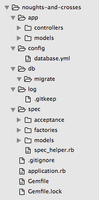

Chapter #2. Database Managment and General Service Structure
============================================================
In this chapter we will create service for simple game Tic Tac Toe (Noughts and Crosses) and we will focus more on service structure and database management tasks, such as create database, creation migration, run migration, rollback migration.

We will store games in relational database (namely postgreSQL but you can use different such as SQLite or MySQL). Game keeps it's board, after create board is empty. Service allows player to make a move on particular game's board after that service makes own move and responds with updated game representation in text format.

Here is representation of empty game's board:

       |   |
    -----------
       |   |
    -----------
       |   |

And here is like it can look after first move:

       |   |
    -----------
     O | X |
    -----------
       |   |

## Service interface.

After we create service player should be able to create game by POSTing on games URL:

    $ curl -X POST "localhost:4567/api/v1/games.txt"
    Game #1
    Status: In Progress

       |   |
    -----------
       |   |
    -----------
       |   |

And make a move by PUTing game attributes on specific game URL:

    $ curl -X PUT "localhost:4567/api/v1/games/1.txt?game%5Bmove%5D=4"
    Game #1
    Status: In Progress

       |   |
    -----------
     O | X |
    -----------
       |   |

Service responds with own move and notifies about game status: "In Progress", "Won", "Lost", "Draw". Note that player provides a HASH of game params, in this case it is GET params (part of URL), but actually should be POST params (provided in HTTP request body) - we stay for awhile with GET params for some simplicity. URL length is limited depending on your web server, so in general we should use POST. Game's HASH contains only one key - move, and it's value is number of cell in with player wants to place cross - "X" (cell should be empty). If game is not finished after player's move computer puts "O" on empty cell. Cells are numbered from 0 till 9 (this is not rules this is our representation of cells mixed with way to make a move):

     0 | 1 | 2
    -----------
     3 | 4 | 5
    -----------
     6 | 7 | 8

If game is not finished player can make another move. Game considered finished it is won or lost or there are no empty cells anymore. Game considerd won (by player) if there are three crosses on board are placed on one line (horizontal, vertical or diagonal). Game considerd lost (by player) if there are three noughts on board are placed on one line (horizontal, vertical or diagonal).

## Game's model interface.

Our game model should behave like this:

```ruby
# created new game with empty board.
game = Game.create

# Game has it's own unique ID
game.id

# making a move (computer makes countermove and saves record into database)
game.update_attributes(move: 4)

# Game status: "In Progress", "Won", "Lost", "Drow"
gmae.status

# Array of board cells: each value equals one of strings "X", "O" or ""
game.cells
```

## Create skeleton of the service

Create please `noughts-and-crosses` forler and file named `Gemfile` in it with list of needed gems:

```ruby
source 'https://rubygems.org'

gem 'rake'
gem 'sinatra'
gem 'pg'
gem 'activerecord'
gem 'protected_attributes'
gem 'sinatra-activerecord'

group :development, :test do
  gem 'thin'
  gem 'pry-debugger'
end

group :test do
  gem 'rspec'
  gem 'shoulda'
  gem 'factory_girl'
  gem 'database_cleaner'
  gem 'rack-test'
end
```

In terminal navigate to `noughts-and-crosses` folder and run `bundle install`. We split gems into groups: some of them needed only for testing, some only for testing and development. Note gem `sinatra-activerecord` - it is used for automatically establishing database connection by configure file and for database management rake tasks.

Now create file `application.rb` in `noughts-and-crosses` folder, this would be main service file.

```ruby
require 'bundler/setup'
Bundler.require :default, (ENV['RACK_ENV'] || :development).to_sym
puts "Loaded #{Sinatra::Application.environment} environment"

set :root, File.dirname(__FILE__)
use Rack::CommonLogger, File.new(File.join(settings.root, 'log',
  "#{settings.environment}.log"), 'a+').tap { |f| f.sync = true }

Dir[File.join(settings.root, "app/models/*.rb")].each do |f|
  autoload File.basename(f, '.rb').classify.to_sym, f
end
Dir[File.join(settings.root, "app/controllers/*.rb")].each { |f| require f }

before do
  content_type :txt
end

error(ActiveRecord::RecordNotFound) { [404, "There is no Game with provided id"] }
error(ActiveRecord::RecordInvalid) { [422, env['sinatra.error'].record.errors.full_messages.join("\n")] }
error { "An internal server error occurred. Please try again later." }
```

Let's walk through it by small bits

```ruby
require 'bundler/setup'
Bundler.require :default, (ENV['RACK_ENV'] || :development).to_sym
puts "Loaded #{Sinatra::Application.environment} environment"
```

Here we are requirung all games of specific environments. We can run service in different environments by passing RACK_ENV. By default environment is `development`.

    RACK_ENV=production ruby application.rb

Set service root.

```ruby
set :root, File.dirname(__FILE__)
```

Then we can refer to it as `settings.root`.

Setup access logger:

```ruby
use Rack::CommonLogger, File.new(File.join(settings.root, 'log',
  "#{settings.environment}.log"), 'a+').tap { |f| f.sync = true }
```

We should create log folder inside `noughts-and-crosses` folder. If we use git we might want to create file `.gitignore` in `noughts-and-crosses` folder with next content.

    log/*.log

This prevents the log files in the repository. Also we can create empty file `.gitkeep` or just `.keep` inside `log` folder to ensure that empty log folder to be in repo(sitory).

Next. We will keep our model class files inside `models` dir inside `app` dir (that is inside `noughts-and-crosses` dir). And we autoload all this files. This means file will actually loaded in memory only after first attempt to use class. Also we will keep all routes in `app/controllers` folder. All routes related to one model will be in one file. And in one file will be routes related to only one model.

```ruby
Dir[File.join(settings.root, "app/models/*.rb")].each do |f|
  autoload File.basename(f, '.rb').classify.to_sym, f
end
Dir[File.join(settings.root, "app/controllers/*.rb")].each { |f| require f }
```

In this service we will only have one model - `Game` and that is why only one controller.

Content type of responses will be plain text. "Content-Type: text/html" header is provided for this.

```ruby
before do
  content_type :txt
end
```

And handle some errors and respond with appropriate HTTP code. 404 - for record no found, and 422 - for validation errors.

```ruby
error(ActiveRecord::RecordNotFound) { [404, "There is no Game with provided id"] }
error(ActiveRecord::RecordInvalid) { [422, env['sinatra.error'].record.errors.full_messages.join("\n")] }
error { "An internal server error occurred. Please try again later." }
```

Last one line handles all other unexpected errors and responds with 500 HTTP code.

Now plese create folders `app/models`, `app/controllers`. Create folder `config` inside `noughts-and-crosses` with file `database.yml` in it. This file will be used by gem `sinatra-activerecord` by default. Here is my configuration (change username in it):

```yaml
development:
  adapter: postgresql
  encoding: unicode
  database: noughts_and_crosses_development
  username: alex

test:
  adapter: postgresql
  encoding: unicode
  database: noughts_and_crosses_test
  username: alex
```

Create folder `db` inside root folder and folder `migrate` inside `db`. Create folder `spec` for tests, file `spec_helper.rb`, folders `acceptance`, `factories`, `models` in it.

Here is `spec_helper.rb`

```ruby
ENV['RACK_ENV'] = 'test'
require File.expand_path("../../application", __FILE__)

FactoryGirl.find_definitions

RSpec.configure do |config|
  config.include Rack::Test::Methods
  config.include FactoryGirl::Syntax::Methods
  config.default_formatter = 'doc' if config.files_to_run.one?

  def app
    Sinatra::Application
  end

  config.before(:suite) do
    DatabaseCleaner.clean_with :truncation
    DatabaseCleaner.strategy = :transaction
  end

  config.before(:each) do
    DatabaseCleaner.start
  end

  config.after(:each) do
    DatabaseCleaner.clean
  end
end
```

And here is all service structure for a while 

## Create migration

Now we need to create a model. But first we need to create a migration. We will use `rake` tasks for this form gem `sinatra-activerecord`. Create please file `Rakefile` in service root folder (`noughts-and-crosses` folder)

```ruby
require_relative 'application'
require 'sinatra/activerecord/rake'
```

Then go to service root dir in terminal and run

    $ rake db:create
    $ rake db:create_migration NAME=create_games
    Loaded development environment
    db/migrate/20150129204548_create_games.rb

Then open new file in text editor and edit it

```ruby
class CreateGames < ActiveRecord::Migration
  def change
    create_table :games do |t|
      t.string :board, null: false, default: ',,,,,,,,'
      t.timestamps null: false
    end
  end
end
```

Navigate to terminal again and run

    $ rake db:migrate
    Loaded development environment
    == 20150129204548 CreateGames: migrating ======================================
    -- create_table(:games)
       -> 0.0105s
    == 20150129204548 CreateGames: migrated (0.0107s) =============================

We will store game board as string (comma separated "X", "O" or ""), we can store it in any other sting format or array - you always have choices.

## Create model

Game realisation is not really significant, because we are focusing more on top behaviour. Anyway here is my representation of game class (file `app/models/game.rb`).

```ruby
class Game < ActiveRecord::Base
  before_update :make_a_move

  validates_format_of :board, with: /\A(?:[XO]?,){8}[XO]?\Z/
  validates :move, presence: true, on: :update
  validates :move, inclusion: { in: [*0..8], message: 'is out of the board',
    allow_nil: true }, on: :update
  validate :ensure_geme_not_finished, on: :update
  validate :ensure_move_allowed, on: :update

  attr_accessible :move
  attr_reader :move

  def move=(index)
    @move = index.to_i if index.present?
  end

  def won?
    lines.include? "XXX"
  end

  def lost?
    lines.include? "OOO"
  end

  def finished?
    won? or lost? or cells.none?(&:blank?)
  end

  def status
    return 'In Progress' unless finished?
    won? ? 'Won' : (lost? ? 'Lost' : 'Draw')
  end

  def cells
    @cells ||= board.split(',', 9)
  end

private
  def part(*indexes)
    cells.values_at(*indexes).join
  end

  def lines
    [part(0,1,2), part(3,4,5), part(6,7,8), part(0,3,6),
      part(1,4,7), part(2,5,8), part(0,4,8), part(2,4,6)]
  end

  def ensure_geme_not_finished
    errors.add(:base, "Game is finished.") if finished?
  end

  def ensure_move_allowed
    errors.add(:move, "not allowed, cell is not empty.") if move && cells[move] != ''
  end

  def make_a_move
    cells[move] = 'X'
    unless won?
      empty_indexes = [*0..8].select { |ind| cells[ind] == '' }
      cells[empty_indexes.sample] = 'O'
    end
    self.board = cells.join(',')
  end
end
```

And model tests in file `spec/models/game_spec.rb`

```ruby
require "spec_helper"

describe Game do
  describe "validations" do
    it { is_expected.not_to allow_value('').for(:board) }
    it { is_expected.to allow_value(',,,,,,,,').for(:board) }
    it { is_expected.to allow_value(',,X,X,,,O,,').for(:board) }
    it { is_expected.to allow_value('O,,X,X,,,O,,').for(:board) }
    it { is_expected.not_to allow_value(',,x,,,,,,').for(:board) }
    it { is_expected.not_to allow_value(',O,,X,X,,,O,,').for(:board) }
    it { is_expected.not_to allow_value('O,,X,X,,,O,').for(:board) }

    it { should validate_inclusion_of(:move).in_array([*0..8]).on(:update) }

    it "can not update finished game" do
      game = create(:game, board: 'X,,O,O,X,,,,X')
      expect { game.update_attributes!(move: '5') }.to raise_error
      expect(game.errors.full_messages).to include "Game is finished."
    end

    it "can not make a move at busy cell" do
      game = create(:game, board: ',,O,,X,,,,')
      expect { game.update_attributes!(move: '4') }.to raise_error
      expect(game.errors.full_messages).to include "Move not allowed, cell is not empty."
    end

    it "can make a move at free cell if geme is not finished" do
      game = create(:game, board: ',,X,O,X,,O,,')
      expect { game.update_attributes!(move: '5') }.not_to raise_error
    end

    it "records player move" do
      game = create(:game, board: 'O,,X,O,X,,,,')
      game.update_attributes!(move: '5')
      expect(game.board.count('X')).to eq 3
    end

    it "makes and records computer move after player move if game not won" do
      game = create(:game, board: 'O,,X,O,X,,,,')
      game.update_attributes!(move: '5')
      expect(game.board.count('O')).to eq 3
    end

    it "does not make computer move after player move if game won" do
      game = create(:game, board: 'O,,X,O,X,,,,')
      game.update_attributes!(move: '6')
      expect(game.board.count('O')).to eq 2
    end
  end

  describe 'assignament' do
    it { is_expected.not_to allow_mass_assignment_of(:board) }
    it { is_expected.not_to allow_mass_assignment_of(:cells) }
    it { is_expected.to allow_mass_assignment_of(:move) }
  end

  describe "creation" do
    specify "new game populated with empty board before create" do
      expect(subject.board).to eq ",,,,,,,,"
    end
  end

  describe "#won?" do
    it "is true if at least one of the board lines is filled with crosses" do
      expect(build(:game, board: 'X,,O,O,X,,,,X')).to be_won
      expect(build(:game, board: ',,O,O,,,X,X,X')).to be_won
    end

    it "is false none of the board lines is filled with crosses" do
      expect(build(:game, board: ',,,,,,,,')).not_to be_won
      expect(build(:game, board: 'X,O,X,O,X,X,O,,O')).not_to be_won
    end
  end

  describe "#lost?" do
    it "is true if at least one of the board lines is filled with noughts" do
      expect(build(:game, board: ',O,X,X,O,,,O,X')).to be_lost
      expect(build(:game, board: 'X,O,O,,O,X,O,X,X')).to be_lost
    end

    it "is false none of the board lines is filled with noughts" do
      expect(build(:game, board: ',,,,,,,,')).not_to be_lost
      expect(build(:game, board: 'X,O,X,X,O,,O,X,')).not_to be_lost
    end
  end

  describe "#finished?" do
    it "is true if at least one of the board lines is filled with three noughts or with three crosses (won or lost)" do
      expect(build(:game, board: 'X,,O,O,X,,,,X')).to be_finished
      expect(build(:game, board: ',,O,O,,,X,X,X')).to be_finished
      expect(build(:game, board: ',O,X,X,O,,,O,X')).to be_finished
      expect(build(:game, board: 'X,O,O,,O,X,O,X,X')).to be_finished
    end

    it "is false none of the board lines is filled with three noughts or with three crosses (neither won or lost)" do
      expect(build(:game, board: ',,,,,,,,')).not_to be_finished
      expect(build(:game, board: 'X,O,X,O,X,X,O,,O')).not_to be_finished
      expect(build(:game, board: 'X,O,X,X,O,,O,X,')).not_to be_finished
    end
  end
end
```

Also factory for tests, file `spec/factories/game.rb`

```ruby
FactoryGirl.define do
  factory :game do
  end
end
```

You need rub migration in test mode (or test environment)

    $ RACK_ENV=test rake db:migrate
    Loaded test environment
    == 20150129204548 CreateGames: migrating ======================================
    -- create_table(:games)
       -> 0.0087s
    == 20150129204548 CreateGames: migrated (0.0090s) =============================

And now you can run model tests.

    $ rspec

## Create controller and acceptance tests

At last we are creating routes for playing game! Create please file `app/controllers/games_controller.rb` with next content.

```ruby
post "/api/v1/games.txt" do
  @game = Game.create
  status 201
  erb :game
end

get "/api/v1/games/:id.txt" do
  @game = Game.find(params[:id])
  erb :game
end

put "/api/v1/games/:id.txt" do
  @game = Game.find(params[:id])
  @game.update_attributes!(params[:game])
  erb :game
end

delete "/api/v1/games/:id.txt" do
  @game = Game.find(params[:id])
  @game.destroy
end

template :game do
  (<<-GAME).gsub(/^ {4}/, '')
    <% cells = @game.cells.map { |c| c == '' ? ' ' : c } %>
    Game #<%= @game.id %>
    Status: <%= @game.status %>

     <%= cells.values_at(0,1,2).join(' | ') %>
    -----------
     <%= cells.values_at(3,4,5).join(' | ') %>
    -----------
     <%= cells.values_at(6,7,8).join(' | ') %>
  GAME
end
```

We call this file controller but is only bunch of routes (and teplate) related to game managment API. Now we are ready to run our service with command (form service root in terminal)

    $ ruby application.rb

Alternatively we can create file `config.ru`

```ruby
require File.join(File.dirname(__FILE__), 'application.rb')
run Sinatra::Application
```

And run our service with next command

    $ rackup -p 4567

This file will probably needed for deploy. Extension "ru" stands for "rack up". You can ensure that service works by testing with curl commands provided at the beginning of chapter. In order to ensure correct operation in the future is very desirable to provide an acceptance test. Actually we could start with creating acceptance tests one by one and between this create routes one by one. Put next code in file `spec/acceptance/games_spec.rb` (or `spec/features/games_spec.rb`)

```ruby
require "spec_helper"

describe "Games", type: :request do
  describe "POST /api/v1/games.txt" do
    let(:game) { Game.last }

    it "craetes game with empty board and responds with text representation of game" do
      post "/api/v1/games.txt"
      expect(last_response.status).to eq 201
      expect(last_response.body).to eq (<<-GAME).gsub(/^ {8}/, '')
        Game ##{game.id}
        Status: In Progress

           |   |  
        -----------
           |   |  
        -----------
           |   |  
      GAME
    end
  end

  describe "GET /api/v1/games/:id.txt" do
    let!(:game) { create(:game, board: ",,X,O,X,,O,,") }

    it "responds with ok status and text representation of game if game exists" do
      get "/api/v1/games/#{game.id}.txt"
      expect(last_response).to be_ok
      expect(last_response.body).to eq (<<-GAME).gsub(/^ {8}/, '')
        Game ##{game.id}
        Status: In Progress

           |   | X
        -----------
         O | X |  
        -----------
         O |   |  
      GAME
    end

    it "responds with 404 status and error message if game does not exist" do
      get "/api/v1/games/234.txt"
      expect(last_response.status).to eq 404
      expect(last_response.body).to eq "There is no Game with provided id"
    end
  end

  describe "PUT /api/v1/games/:id.txt" do
    let!(:game) { create(:game, board: ",O,X,O,X,,,,") }

    it "allows player to make a move and responds with text representation of game" do
      put "/api/v1/games/#{game.id}.txt", game: { move: 6 }
      expect(last_response).to be_ok
      expect(last_response.body).to eq (<<-GAME).gsub(/^ {8}/, '')
        Game ##{game.id}
        Status: Won

           | O | X
        -----------
         O | X |  
        -----------
         X |   |  
      GAME
    end

    it "responds with 404 status and error message if game does not exist" do
      put "/api/v1/games/234.txt"
      expect(last_response.status).to eq 404
      expect(last_response.body).to eq "There is no Game with provided id"
    end

    it "responds with 422 status and error message if move not provided" do
      put "/api/v1/games/#{game.id}.txt"
      expect(last_response.status).to eq 422
      expect(last_response.body).to eq "Move can't be blank"
    end

    it "responds with 422 status and error message if move out of the board" do
      put "/api/v1/games/#{game.id}.txt", game: { move: -1 }
      expect(last_response.status).to eq 422
      expect(last_response.body).to eq "Move is out of the board"
    end

    it "responds with 422 status and error message when trying to make a move on a busy cell" do
      put "/api/v1/games/#{game.id}.txt", game: { move: 2 }
      expect(last_response.status).to eq 422
      expect(last_response.body).to eq "Move not allowed, cell is not empty."
    end
  end

  describe "DELETE /api/v1/games/:id.txt" do
    let!(:game) { create(:game, board: ",,X,O,X,,O,,") }

    it "responds with ok status and text representation of game if game exists" do
      delete "/api/v1/games/#{game.id}.txt"
      expect(last_response).to be_ok
      expect(Game.all).to be_empty
    end

    it "responds with 404 status and error message if game does not exist" do
      delete "/api/v1/games/234.txt"
      expect(last_response.status).to eq 404
      expect(last_response.body).to eq "There is no Game with provided id"
    end
  end
end
```

Then you can run tests

    $ rspec
    Loaded test environment
    ..................................

    Finished in 0.4139 seconds (files took 1.8 seconds to load)
    34 examples, 0 failures

Everything is fine, can go to bar now. Oh, wait! Two more things...

## Create console

We can create development console for data quick access. Create please folder `script` in service root folder and file `console` in it:

```ruby
#!/bin/bash
bundle exec irb -r ./application.rb
```

Change file to be executable (in unix-like systems)

    $ chmod +x script/console

And we can use it in development environment by default

    $ script/console
    Loaded development environment
    irb >

Or in test or production environment

    $ RACK_ENV=test script/console
    Loaded development environment
    irb >

Type `quit` and hit enter (or maybe `Ctrl` + `c`) for quit, this is normal irb with preloaded `application.rb` file.

## Add custom rake task

Ok what to do if we need to create custom rake task? For example we might want to be able delete all games that are older than one day. We need to create database index first on `created_at` column for better performance. We should do such task in separate migration if previous is already deployed. Who is stopping us?

    $ rake db:create_migration NAME=add_index_on_games_created_at
    Loaded development environment
    db/migrate/20150129215128_add_index_on_games_created_at.rb

Apply creatd migration file

```ruby
class AddIndexOnGamesCreatedAt < ActiveRecord::Migration
  def change
    add_index :games, :created_at
  end
end
```

Run it on both environments

    $ rake db:migrate
    == 20150129215128 AddIndexOnGamesCreatedAt: migrating =========================
    -- add_index(:games, :created_at)
       -> 0.0051s
    == 20150129215128 AddIndexOnGamesCreatedAt: migrated (0.0054s) ================

    $ RACK_ENV=test rake db:migrate
    == 20150129215128 AddIndexOnGamesCreatedAt: migrating =========================
    -- add_index(:games, :created_at)
       -> 0.0052s
    == 20150129215128 AddIndexOnGamesCreatedAt: migrated (0.0054s) ================

Create folder `lib` in service root folder. Create folder `tasks` in it. And create file `delete_old_games.rake` in `taks` folder (`lib/tasks/delete_old_games.rake`)

```ruby
desc 'Delete all games that are older that one day'
task :delete_old_games do
  Game.where(Game.arel_table[:created_at].lt(1.day.ago)).delete_all
end
```

Add one line to `Rakefile`. We show full version

```ruby
require_relative 'application'
require 'sinatra/activerecord/rake'
Dir.glob('lib/tasks/**/*.rake').each { |r| load r }
```

And that is it! Check that new rake task is available.

    $ rake -T
    Loaded development environment
    rake db:create              # Creates the database from DATABASE_URL or config/database.yml for the current RAILS_ENV (use db:create:all to create all databases in the...
    rake db:create_migration    # Create a migration (parameters: NAME, VERSION)
    rake db:drop                # Drops the database from DATABASE_URL or config/database.yml for the current RAILS_ENV (use db:drop:all to drop all databases in the config)
    rake db:fixtures:load       # Load fixtures into the current environment's database
    rake db:migrate             # Migrate the database (options: VERSION=x, VERBOSE=false, SCOPE=blog)
    rake db:migrate:status      # Display status of migrations
    rake db:rollback            # Rolls the schema back to the previous version (specify steps w/ STEP=n)
    rake db:schema:cache:clear  # Clear a db/schema_cache.dump file
    rake db:schema:cache:dump   # Create a db/schema_cache.dump file
    rake db:schema:dump         # Create a db/schema.rb file that is portable against any DB supported by AR
    rake db:schema:load         # Load a schema.rb file into the database
    rake db:seed                # Load the seed data from db/seeds.rb
    rake db:setup               # Create the database, load the schema, and initialize with the seed data (use db:reset to also drop the database first)
    rake db:structure:dump      # Dump the database structure to db/structure.sql
    rake db:structure:load      # Recreate the databases from the structure.sql file
    rake db:version             # Retrieves the current schema version number
    rake delete_old_games       # Delete all games that are older that one day

And run it

    $ rake delete_old_games

## Summary

We covered a lot in this chapter, this one was the most hardest. Next time we will omit all this infrastructure setup and will focus on more interesting staff. We have used gem [sinatra-activerecord](https://github.com/janko-m/sinatra-activerecord) which extends sinatra with rake tasks for database management and handles establishing database connection. This gem is sinatra extension. You may want to get more familiar with [sinatra extensions](http://www.sinatrarb.com/extensions.html).
